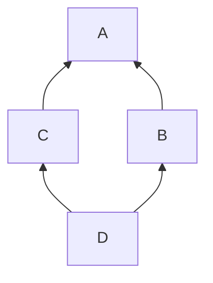
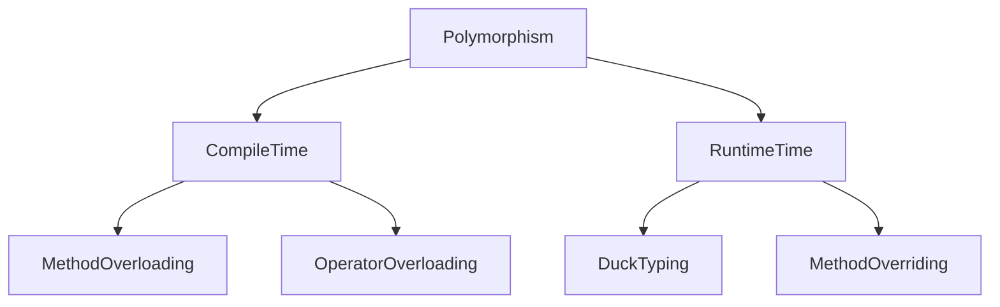
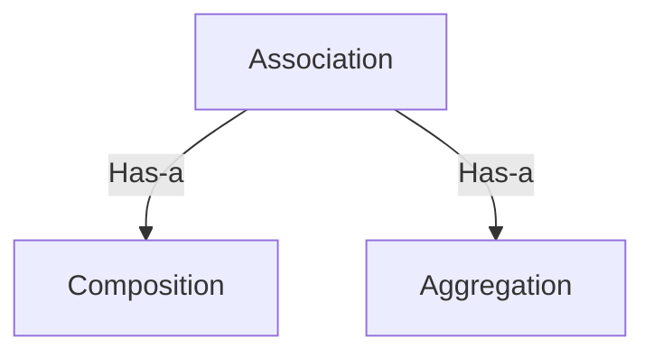
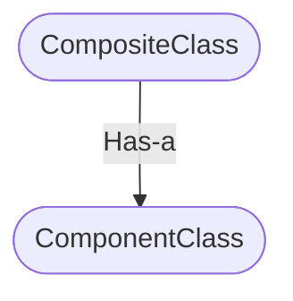
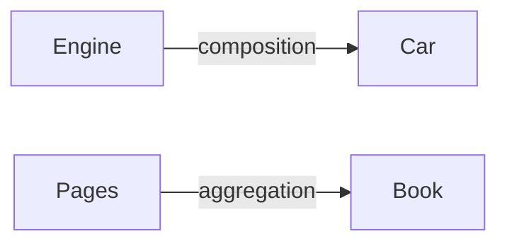

# **Python OOP notes**

### Author : Syed Arsalan Amin

## **Contents:**

1. Pillars of OOP
2. Constructer vs Destructer
3. Method types
4. Class vs Instance Attributes
5. Class vs Instance methods
6. Magic Methods
7. Making Custom Containers
8. Encapsulation
9. Properties in python

---

## **1. Pillars of oop:**

1. Inheritance.
2. Polymorphism.
3. Encapsulation.
4. Abstraction.

A constructor(**init**) which decides how much particular properties get initialized inside the class.

```python
class Car(): # making a class. Class name should be capital.
    def __init__(self, windows, doors, enginetype):#constructer.
        self.windows=windows #this __init__ block is
        self.doors=doors # constructer.
        self.enginetype=enginetype

    def drive(self):
        print("The Person drives the car")

    #car is object being created. Self actually indicates/points to the object being created.

car=Car(4,5,"diesel")

print(car.windows)
car.drive()
----------------------------
Output:
4

The Person drives the car
```

## **2. Constructer vs Destructer:**

**Constructer:**

The task of constructors is to initialize(assign values) to the data members of the class when an object of class is created.
In python it's `__init__`.

Destructors:
Destructers are called when an object gets destroyed. In Python, destructors are not needed as much needed in C++ because Python has a garbage collector that handles memory management automatically. The **del**() method is a known as a destructor method in Python.

## **3. Method types:**

1. **Instance method:**
   An instance method is a method that belongs to instances of a class, not to the class itself.
2. **Static method:**
   We generally use class method to create factory methods. Factory methods return class objects ( similar to a constructor ) for different use cases.
3. **Class method:**
   We generally use static methods to create utility functions.

## **4. Class vs Instance Attributes:**

"Class attributes are common to all object of a particular class."

like human class its class attributes could be blue_eyes, tall, beautiful,etc.

Each instance/object of a class have thier own INSTANCE ATTRIBUTES.
But for CLASS ATTRIBUTES they are same for all the instances/objects of class.

For example :
'All humans can have different names(instance attributes)but all humans have same no. of eyes(class attributes).'
Naming convention:
  Object also called instance.
  Variable also called attribute.

```python
class Point():
    default_color = "red"  # this is a CLASS ATTRIBUTE.
    # this is instance methods
    def __init__(self, x, y):
        # these are INSTANCE ATTRIBUTES.
        self.x = x
        self.y = y
    # this is instance methods
    def draw(self):
        print(f"Point({self.x}, {self.y})")

point = Point(10, 20)  # object/instance of class Point

# object level reading of class attribute(object referencing)
print(point.default_colour)

# class reference reading of class attribute(class referencing)
print(Point.default_color)

point.draw()   # call the method draw
----------------------------
Output:
red
red
Point(10, 20)
Point(10, 20)

```

## **5. Class vs Instance vs Static methods**

"Class method makes your object creation process easier by enabling you to create factory method instead of providing all parameters of the class at object creation step."

_like human class its classmethod could be walk, run, talk, etc._

**Explanation**:
Using instance/object of class we can access the instance methods.But sometimes we don't need to create the object of class to access the methods.For accessing class methods we use class reference to access it.Sometimes object initialization is hard and for this we need to create class method that have the attributes initialization. Below class method return a object that have already x and y attributes initialized as 0, when we call class method by class reference then we have another point object with x,y as 0.

- ways to access the instance methods:

  - class reference
  - object reference

- Naming convention:
  - Object also called instance.
  - Variable also called attribute.

```python
class Point():
    # instance method.
    def __init__(self, x, y):  
        self.x = x  # instance attributes
        self.y = y

    @classmethod
    def zero(cls):
        # return object of class Point which  has x=0 and y=0 attributes.
        # cls(0,0) = Point(0,0)
        # cls = classname
        return cls(0, 0)

    def draw(self):  # this is INSTANCE METHOD.
        print(f"Point({self.x}, {self.y})")

# Method1:accessing instance method using object reference.
point = Point(0, 0)
#point.draw()

# These two same point objects initialized as x=0,y=0.But the second one handy for sometimes when there are many specific attributes to provide and we don't want to create object for it.

# Method2:accessing class method using class reference.
point = Point.zero() # you only called 'zero' method instead of providing point.draw() # 0,0 parameters. classmethod is handy when providing large parameters.
point.draw()
----------------------------
Output:
Point(0, 0)
```

### **Static methods:**

- It does not receive an implicit `first argument`.
- You `don't need to create an object` of class to access the static methods.

**Class method vs Static Method:**

- A class method takes `cls` as the first parameter while a static method `needs no specific parameters`.
- A class method can access or modify the class state while a static method `can’t access or modify it`.
- They are `utility-type methods` that take some parameters and work upon those parameters. On the other hand class methods must have class as a parameter.

**When to use what?**

- We generally use class method to create `factory methods`.
- We generally use static methods to create `utility functions`.

```python
# Python program to demonstrate
# use of class method and static method.
from datetime import date

class Person:
    def __init__(self, name, age):
        self.name = name
        self.age = age

    # a class method to create a Person object by birth year.
    @classmethod
    def fromBirthYear(cls, name, year):
        return cls(name, date.today().year - year)

    # a static method to check if a Person is adult or not.
    @staticmethod
    def isAdult(age):
        return age > 18

person = Person.fromBirthYear('aslan', 1996)

# print(person.age)
print(person.age)

# note that we didn't used object to call static method
print(Person.isAdult(22))
----------------------------
Output:
25
True
```

## **6. Magic Methods:**

`__init__` :
useful for initializing attributes.

`__str__` : whenever we print object it gives us name of the class and memory address, but you reimplement it.e.g

```python
# using point class above

class Point():
    def __init__(self, x, y):
        # these are INSTANCE ATTRIBUTES.
        self.x = x
        self.y = y

    def __str__(self):
        return f"Point ({self.x}, {self.y})"

point = Point(0, 0)
print(point)
----------------------------
Output:
Point (0, 0)
```

`__eq__` : Compairing two object if they are equal with parameters.e.g:

```python
# using point class above

class Point():
    def __init__(self, x, y):
        # these are INSTANCE ATTRIBUTES.
        self.x = x
        self.y = y

    def __str__(self):
        return f"Point ({self.x}, {self.y})"

    def __eq__(self, other):
        return self.x == other.x and self.y == other.y

point = Point(10, 20)
other = Point(10, 20)
print(point == other)
----------------------------
Output:
True
```

`__eq__` : Compairing two object if they are equal with parameters.e.g:

```python
# using point class above
class Point():
    def __init__(self, x, y):
        # these are INSTANCE ATTRIBUTES.
        self.x = x
        self.y = y

    def __str__(self):
        return f"Point ({self.x}, {self.y})"

    def __eq__(self, other):
        return self.x == other.x and self.y == other.y

point = Point(10, 20)
other = Point(10, 20)
print(point == other)
----------------------------
Output:
True
```

`__gt__` :Compairing two object if one is greater than other.e.g:

```python
# using point class above
class Point():
    def __init__(self, x, y):
        # these are INSTANCE ATTRIBUTES.
        self.x = x
        self.y = y

    def __str__(self):
        return f"Point ({self.x}, {self.y})"

    def __gt__(self, other):
        return self.x > other.x and self.y > other.y

point = Point(10, 20)
other = Point(1,2)

print(point == other)
print(point > other)
print(point < other)
----------------------------
Output:
False
True
False
```

`__add__` :adding two objects together.e.g

```python
class Point():
    def __init__(self, x, y):
        # these are INSTANCE ATTRIBUTES.
        self.x = x
        self.y = y
    # its return type is always a str
    def __str__(self):
        return f"Point ({self.x}, {self.y})"

    def __add__(self, other):
        return Point(self.x+other.x, self.y+other.y)


point = Point(10, 20)
other = Point(1, 2)

combined = point + other
print(combined)
----------------------------
Output:
Point (11, 22)
```

`__getitem__`: this magic method is used to get items from the object using square brackets.e.g object["item"]

```python
class Store():

    def __init__(self,fruit):
        self.fruit = fruit

    def __getitem__(self, item):
        print('getitem: ',item)


test = Store()

# get the value of item
test['apple']
----------------------------
Output:
getitem:  apple
```

`__setitem__`: Used to set value to a key of the object.

```python

class Store():
    def __init__(self,fruit):
        self.fruit = fruit

    # it only returns a string
    def __str__(self):
        return str(self.fruit)

    def __setitem__(self,fruit):
        self.fruit = fruit

test = Store('apple')

# set the value for fruit
test.fruit='Mango'

print(test)
----------------------------
Output:
Mango
```

`__len__`:gives the length of the dictionary

```python
class Store():
    def __init__(self,fruit):
        self.fruit = fruit

    def __len__(self):
        return len(self.fruit)

test = Store('apple')

len(test)
----------------------------
Output:
5
```

`__iter__`: gives the iterator and we can iterate using loop on it.

```python

class Store():
    def __init__(self, item):
        self.item = item

    def __iter__(self):
        return iter(self.item)

test = Store([0, 1, 2])

i = iter(test)

print(next(i))
print(next(i))
print(next(i))
----------------------------
Output:
0
1
2
```

## **7. Making Custom Containers:**

"To add more functionality of our own to the standard python data types like list, dictionary, etc."

All the functionality/complexity is hidden from the rest of the program, we can say that all the complexity is encapsulated from the rest of the program so that our code looks simpler and cleaner.e.g:

```python
# class to store the add count of the objects.
class TagCloud:
    def __init__(self):
        self.tags = {}

    #using .get() method to input key and default value 0 in dictionary.
    def add(self, tag):
        self.tags[tag.lower()] = self.tags.get(tag.lower(),0) + 1

cloud = TagCloud()
cloud.add("python")
cloud.add("java")
cloud.add("Python")
print(cloud.tags)
----------------------------
Output:
{'python': 2, 'java': 1}
```

## **8. Encapsulation:**

`"It describes the idea of wrapping data and the methods that work on data within one unit."`
This puts restrictions on accessing variables and methods directly and can prevent the accidental modification of data.

`"Access modifiers assist the implementation of encapsulation in python."`

**1. Public members**:"Accessible from anywhere in the program."

**2. Protected members:** "The members of a class that are declared protected are only accessible to a class and the classes derived from it."

protected members of a class can be accessed by other members within the class and are also available to their subclasses. No other entity can access these members. In order to do so, they can inherit the parent class. Python has a unique convention to make a member protected: Add a `prefix _ (single underscore)`.
e.g:

```python
def __init__(self):
    self._tags = {}
```

**3. Private members**:"Accessible within the class only but gives user warning !"

python doesn't have anything called private member variable in Python. However, adding `two underlines(__)` at the beginning makes a variable or a method private is the convention used by most python code.e.g:

```python
def __init__(self):
    self.__tags = {}
```

## **9. Properties in python:**

"Properties sit in front of attributes and allow us to get and set value of an attribute easily(you can both set and get using only one property object) and cleanly(you don’t have to use get_price and set_price methods)."

**Main purpose of using getters and setters in object-oriented programs is to ensure data encapsulation.**

Getters and Setters in python are often used when:

**1. We use getters & setters to add validation logic around getting and setting a value.**\
**2. To avoid direct access of a class field i.e. private variables cannot be accessed directly or modified by external user.**

> Note: `function name` should be same as the `variable name`.

> Note: Always define `protected` or `private` attributes in property.

### **Python's property() is the Pythonic way to avoid formal getter(`__getitem__`) and setter(`__setitem__`) methods in your code.**

```python
#Below code prevents to put (-ve) value in the class attributes, it uses python properties.
class Store():
    def __init__(self):
        self._fruit = ''

    # getter method
    @property
    def fruit(self):
        print('getter method called')
        return self._fruit

    # setter method
    @fruit.setter
    def fruit(self, fruit):
        print('setter method called')
        self._fruit = fruit

    # deleter method
    @fruit.deleter
    def fruit(self):
        print(self.fruit, '-> deleted')
        del self._fruit

test = Store()

test.fruit = 'Mango'

print(test.fruit)

del test.fruit
----------------------------
Output:
setter method called
getter method called
Mango
getter method called
Mango -> deleted
```

### **Read-only Attributes:**

Read-Only Attributes are created by raise Exception in the setter method.

```python
class Store():
    def __init__(self):
        self._fruit = ''

    # getter method
    @property
    def fruit(self):
        print('getter method called')
        return self._fruit

    # setter method
    @fruit.setter
    def fruit(self,fruit):
        raise Exception("Can't set, Attributes are read-only")

test = Store()

test.fruit = 'Mango'
----------------------------
Output:
Exception: Attributes are read-only
```

## **10. Inheritance:**

**Inheritance**:
"Inherite attributes and methods from other classes."

Uses:

1. Prevents code duplication.
2. Code reusablity.

- Types:
  - **Single:** Inherited from parent to child.
  - **Multi-level**: Multilevel Inheritance is when a class inherits from a derived class, making that derived class a base class for a new class.
  - **Multiple**: Multiple Inheritance is when a class inherits from many base classes
  - **Hierarchical:** More than one class is inherited from a single parent or base class
  - **Hybrid:** A hybrid inheritance is a combination of more than one types of inheritance.


```python
# Animal is the base/parent class.
class Animal:
    def __init__(self):
        self.age = 1

    def eat(self):
        print('eat')

# Mammal is the child class, Mammal is inheriting from Animal class.
class Mammal(Animal):
    def walk(self):
        print('walk')


class Fish(Animal):
    def swim(self):
        print("swim")


m = Mammal()
m.eat()  # inheriting method.
print(m.age)  # inheriting attribute.
m.walk()

fish = Fish()
fish.swim()
fish.eat()
----------------------------
Output:
eat
1
walk
swim
eat
```

Checks instance of class:

```python
print(isinstance(m, Mammal))
print(issubclass(Mammal, Animal))
----------------------------
Output:
True
True
```

### **Method overriding/run time Polymorphism:**

"In this condition child class constructor replace the parent class constructor."

> **Note:** It is run time Polymorphism because both constructors have same name `__init__` but different functionalities.

```python
#In the below code self.age is not initialized as it get replaced by the child class constructor.
class Animal:
    def __init__(self):
        self.age = 1

class Mammal(Animal):
    # always child __init__ is called first
    def __init__(self):
        self.weight = 2

m = Mammal()
print(m.age)
print(m.weight)
----------------------------
Output:
AttributeError: 'Mammal' object has no attribute 'age'

```

### **Super() function:**

So if you want to call both parent and child constructor then use `super()` function.e.g:

```python
class Animal:
    def __init__(self):
        self.age = 1
        print('Animal constructer')

class Mammal(Animal):
    # always child __init__ is called first
    def __init__(self):
        print('Mammal constructer')
        super().__init__()
        self.weight = 2

m = Mammal()
print(m.age)
print(m.weight)
----------------------------
Output:
Mammal constructer
Animal constructer
1
2
```

## **Multi-level Inheritance:**

**Inherite from parent class and then child, then the child to another child and so on.**

> **Note:** This is not recommended normally! If you want to do it just do 2 to 3 levels more levels add complexity to the code.

```python
#The problem here is that in real-world chicken is a bird but can't fly. So that much levels is normally not recommended.
class Animal:
    def eat(self):
        print('eat')

class Bird(Animal):
    def fly(self):
        print('fly')

class Chicken(Bird):
    pass
```

## **Multiple Inheritance:**

"From multiple classes import attributes or methods in a particular class."

2 parents - 1 child

You can combine the features/attribute of many classes into one class as in the Manager class.

```python
class Employee:
    def greet(self):
        print("Employee greet!")

class Person:
    def greet(self):
        print("Person greet!")

# First the python interpreter looks for greet method in
# Manager->Employee->Person class
class Manager(Employee, Person):
    pass

m = Manager()
m.greet()
----------------------------
Output:
Employee greet!
```

### **Diamond Problem**

In multiple inheritance if at the calling object program confuses which method to call first a or b or c.

> Note: It don’t exist in python because in python we can arrange the objects by the place of the parameters in the child class.

```python
class A:
    def met(self):
        print("This is a method from class A")

class B(A):
    def met(self):
        print("This is a method from class B")


class C(A):
    def met(self):
        print("This is a method from class C")

# first inherite C then B
class D(C, B):
    def met(self):
        print("This is a method from class D")

a = A()
b = B()
c = C()

d = D()
d.met()
----------------------------
Output:
This is a method from class D
```



## **Hierarchical Inheritance:**

Two childs importing from one parent.

```python
class Stream:
    def __init__(self):
        pass

# Below two classes inherite from the parent Stream class.
class FileStream(Stream):
    def read(self):
        print("Reading data from a file")


class NetworkStream(Stream):
    def read(self):
        print("Reading data from a network")

```

## **Abstract Base Class:**

_Its like half baked cokkie its not ready to be eaten._

**"Abstract base class provide some common code and a common interface to its derivatives."**

**Abstraction:** Is a technique used in OOPS paradigm which shows only relevant details to the user rather than showing unnecessary information on the screen helping in reduction of the program complexity and efforts to understand.

` An abstract method is a method that has a declaration but does not have an implementation.Like:`

```python
    @abstractmethod
    def read(self):
        pass
```

**Issues it resolves:**

1. **Avoiding code duplication:**
   Stream class is a general concept the main idea is like which is type of stream either it is FileStream or NetworkStream more specifically.

   - **Solution 1:**
     So a better approach is to make a abstract class(in our case Stream) and put common functionalities in it that will carry to the other classes.

2. **Common Interface:**
   If need to implement more classes we should have to maintain a common interface across all the classes it is a nicer approach, like to have same methods name across all types of Streams.

   - **Solution 2:**
     So define a abstract method inside a abstract class will enforce a common interface across all classes by enforcing each class to have the same abstract method name in it.

> **Note:** We cannot create instance of an abstract class.

> **Note:** If a class have a abstract method then it is considered a abstract class.

> **Note:** An abstract method is a method that has a declaration but does not have an implementation.

> **Note:** Concrete classes contain only concrete (normal)methods whereas abstract classes may contain both concrete methods and abstract methods.

```python
from abc import ABC, abstractmethod
class Animal(ABC):

    def move(self):
        pass

class Human(Animal):

    def move(self):
        print("I can walk and run")

class Dog(Animal):

    def move(self):
        print("I can bark")


# Driver code
R = Human()
R.move()

R = Dog()
R.move()
----------------------------
Output:
I can walk and run
I can bark
```

### Another example:

```python
from abc import ABC, abstractmethod

class Stream(ABC):
    def __init__(self):
        self.opened = False

    def open(self):
        print('stream opened')
        self.opened = True

    def close(self):

        print('stream closed')
        self.opened = False

    @abstractmethod
    def read(self):
        pass

# following are the concrete classes that use the
# functionalities of the abstract class(problem 1 solved).
class FileStream(Stream):
    def read(self):
        print("Reading data from a file")

class NetworkStream(Stream):
    def read(self):
        print("Reading data from a network")

# MemoryStream is new class that have read() method
# following the same interface (read method as other concrete classes) as the other classes(problem 2 solved).
class MemoryStream(Stream):
    def read(self):
        print("Reading data from a memory")

# here note we cannot create Stream object because it is a abstract class.
stream = MemoryStream()
stream.open()
stream.close()
----------------------------
Output:
stream opened
stream closed
```

### **Concrete Methods in Abstract Base Classes:**

In the following code i've used:

- Abstract class
- Abstract methods
- Super()
- Python property

```python
from abc import ABC, abstractmethod


class People(ABC):
    def __init__(self):
        self._population=10


    def walk(self):
        print('walking')

    def talk(self):
        print('talking')
     #all childs must have 'color' method
    @abstractmethod
    def color(self):
        ...

    # this enforces that property should also be in child class
    @property
    @abstractmethod
    def population(self):
        ...


class Usa(People):
    def __init__(self):
        print('Initialized Usa')
        super().__init__()
    def color(self):
        print('American White color')
    @property
    def population(self):
        return self._population


class Africa(People):
    def __init__(self):
        print('Initialized Africa')
        super().__init__()
    def color(self):
        print('African black color')
    @property
    def population(self):
        return self._population

american = Usa()
american.population
american.color()

african = Africa()
african.population
african.color()
----------------------------
Output:
Initialized Usa
Initialized Africa
10
```

## **11. Polymorphism:**

Function signature: parameters and their types.

Polymorphism means the same function name (but different parameters) being used for different types.
It has 4 types:

1. Duck typing(runtime)
2. Method overriding(runtime)
3. Method overlaoding(compile time)
4. Operator overloading(compile time)



### **1. Duck typing:**

“If it looks like a duck and quacks like a duck, it’s a duck.”

> **Note:** To have polymorphism you don’t need abstract base class but it is a good practice because abstraction enforces common interface.

> **Note:** If the two classes have any same methods then duck typing is possible. Like `draw()` method in the below code.

```python
class Textbox:
    def draw(self):
        print('drawing textbox')

class Car:
    def draw(self):
        print('drawing car')

# it will take objects of any type that has draw() method in its class.
def drawsomething(control):
    return control.draw()

#creating objects of classes
textbox = Textbox()
car = Car()

# this drawsomething method is taking many shapes based on the object you pass at runtime
drawsomething(textbox)
drawsomething(car)
----------------------------
Output:
drawing textbox
drawing car

```

### **2. Method Overriding:**

By using method overriding a class may “copy” another class, avoiding duplicated code, and at the same time enhance part of it.

### **Uses:**

- It `inherite the properties` of the parent class.
- It `override the duplicate code` in the parent class with the child class to enhance the functionality in the child class.

```python
# parent class
class Programming:

    def practice(self):
        print("Practice makes a man perfect")

    def consistency(self):
        print("programming method called")

# child class
class Python(Programming):

    # this function override the parent class function
    def consistency(self):
        print("python method called")


Py = Python()
Py.consistency()
Py.practice()
----------------------------
Output:
python method called
Practice makes a man perfect
```

### **3. Method Overloading:**

Given a single function `sum ()`, the number of parameters can be specified by you.

**The process of calling the same method in different ways is called method overloading.**

> **Note:** No. of parameters specified by user.

```python
class Student:
    def sum(self, salary=None, bonus=None):
        earn = 0
        self.salary = salary
        self.bonus = bonus

        if salary!= None and bonus!=None:
            earn = self.salary + self.bonus

        # if bonus is null
        elif salary!=None:
            earn = self.salary

        return earn

dan = Student()

print(dan.sum(10))
print(dan.sum(10,2))
----------------------------
Output:
10
12
```

### **4. Operator Overloading:**

Python doesn't support it but we can implement it.

**Operator overloading in Python is the ability of a single operator to perform more than one operation based on the class (type) of operands.**

Using operator to add two different classes objects together. Like `"+"` operator can be used to add two _ints_ and also concatenate two _strings_.

```python
class Student:
    def __init__(self, salary, studytime):
        self.salary = salary
        self.studytime = studytime

    # returns the objects with summed up variables
    def __add__(self, other):
        salary = self.salary + other.salary
        studytime = self.studytime + other.studytime

        return Student(salary, studytime)


dan = Student(10, 2)
sam = Student(20, 5)

combined = dan + sam
print(combined.salary)
print(combined.studytime)
----------------------------
Output:
30
7
```

## **12. Namedtuple in Python:**

### Simple tuple

```python
point = (2,4)

# access item using index
point[0]
point[1]
----------------------------
Output:
2
4
```

### NamedTuple

You use a namedtuple() to create an immutable and tuple-like data structure with field names.

```python
from collections import namedtuple

Point = namedtuple('Point', 'x y')

point = Point(2,4)

# access elements using index
print(point[0])
print(point[1])

# access elements using dot notation
print(point.x)
print(point.y)
----------------------------
Output:
2
4
2
4
False
```

## **13. Association:**

Composition and aggregation are specialised form of Association. Whereas Association is a relationship between two classes without any rules.

### **Types:**

1. Composition
2. Association



### **13.1 Composition:**

By creating the object we can access the members of one class inside another class.

In other words, one class is **parent** and other class is **child**. and if you delete the child object then all of its parents objects are also deleted.

> **Note:** In composition, objects can not exist independently. Because child class has the object of parent class.

This type of relationship is known as **Has-A Relation.**



```python
# parent class
class Salary:
    def __init__(self,pay):
        self.pay=pay

    def get_total(self):
       return (self.pay*12)

# child class
class Employee:
    def __init__(self,pay,bonus):
        self.pay=pay
        self.bonus=bonus

        # object of Salary class is created here in Employee class
        self.obj_salary=Salary(self.pay)

    def annual_salary(self):
        return self.obj_salary.get_total() + self.bonus

# child object
obj_emp=Employee(100,10)

print (obj_emp.annual_salary())
----------------------------
Output:
1210
```

### **13.2 Composition vs Inheritance**

- **Inheritance:** It will extend the parent functionality with extra features allows `overriding of methods`.

- **Composition:** It can only use parent class as it is. It cannot modify or extend the functionality of it.

### **13.3 Aggregation:**

Aggregation is a weak form of association.

> **Note:** Objects can exist independently in this relationship. Because unlike composition parent class objects are not created inside child class.



If you delete the child object, parent objects can live without child object.

```python
# parent class
class Salary:
    def __init__(self,pay):
        self.pay=pay

    def get_total(self):
       return (self.pay*12)

# child class
class Employee:
    def __init__(self,bonus, salary):
        self.bonus=bonus

        # object of class is passed as a parameter in this class.
        self.obj_salary=salary

    def annual_salary(self):
        return self.obj_salary.get_total() + self.bonus

# passed to Employee class
salary = Salary(100)

# child object
obj_emp=Employee(10, salary)

print (obj_emp.annual_salary())
----------------------------
Output:
1210
```
